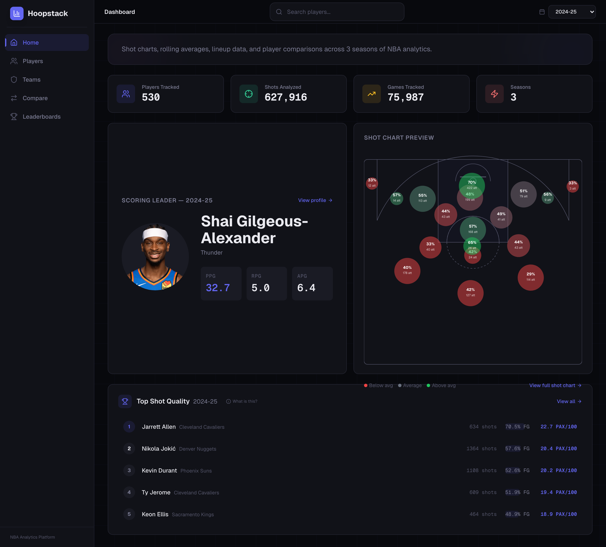
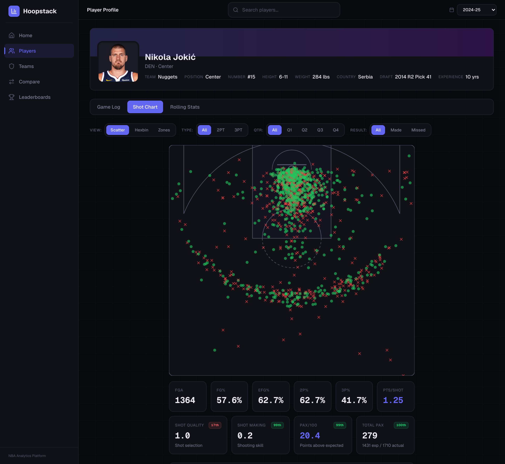
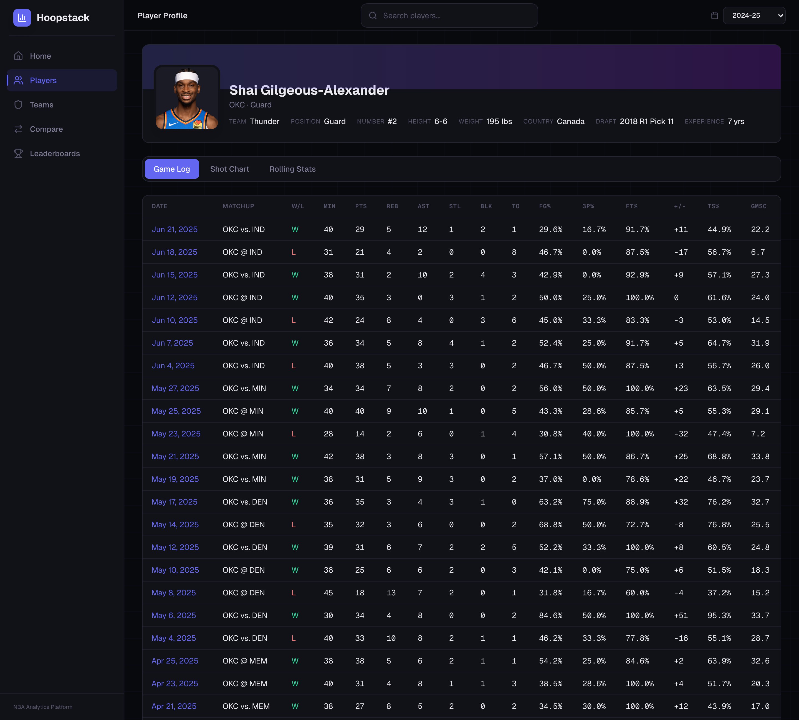
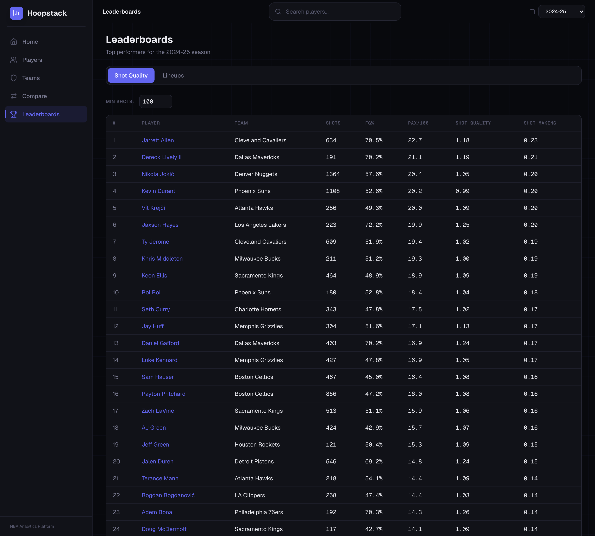

# Hoopstack

[](https://github.com/cameron-rezek/hoopstack/actions/workflows/ci.yml)

An NBA analytics platform built on play-by-play, shot chart, and game log data. Ingests raw data from the NBA Stats API, transforms it through a layered data model (raw → staging → analytics), and serves it through a REST API to power interactive visualizations.

## Screenshots

| | |
|---|---|
| <br>**Dashboard** — coverage totals, scoring leader and a zone shot chart | <br>**Shot chart** — scatter, hexbin and zone views, filterable by shot type, quarter and result |
| <br>**Player detail** — bio, game log and rolling-stat tabs | <br>**Leaderboards** — shot quality and lineup stats |

## Architecture

```
NBA Stats API → Python Ingestion → PostgreSQL (Raw)
                                        ↓
                                   dbt (Staging + Analytics)
                                        ↓
                                   FastAPI (REST API)
                                        ↓
                                   Next.js + D3.js (Frontend)
```

- **Database:** PostgreSQL 16
- **Ingestion:** Python scripts with checkpointing and resume support
- **Transformations:** dbt Core (staging views + analytics tables)
- **API:** FastAPI with asyncpg, API key auth, rate limiting
- **Frontend:** Next.js 16 + D3.js + Recharts, dark theme

## Data

- **Source:** NBA Stats API via `nba_api` Python library
- **Scope:** 2023-24 through 2025-26 seasons
- **Volume:** ~560k shot attempts, ~1.16M play-by-play events, ~75k player game logs
- **Update cadence:** Daily cron job at 6am (+ manual backfill as needed)

## Tech Stack

| Layer | Tech |
|-------|------|
| Database | PostgreSQL 16 |
| Ingestion | Python, nba_api |
| Transformations | dbt Core 1.11, dbt-postgres |
| API | FastAPI, asyncpg, Pydantic, slowapi |
| Frontend | Next.js 16, React 19, D3.js 7, Recharts, Tailwind 4 |

## Project Structure

```
hoopstack/
├── ingestion/       # Python ETL scripts
├── dbt/             # dbt project
│   └── models/
│       ├── staging/     # 6 deduped views (stg_players, stg_shot_charts, etc.)
│       └── analytics/   # 4 aggregate tables (shot quality, lineups, rolling stats, etc.)
├── api/             # FastAPI application
│   ├── main.py
│   ├── config.py
│   ├── database.py
│   ├── routers/     # 9 routers: players, teams, games, shots, lineups, rolling, pbp, seasons, health
│   ├── queries/     # Raw SQL queries (no ORM)
│   ├── models/      # Pydantic response models
│   └── tests/       # pytest suite (mocked pool, no database needed)
├── frontend/        # Next.js app
│   └── src/
│       ├── app/         # 7 routes: /, /players, /players/[id], /teams, /teams/[id], /games/[id], /leaderboards
│       ├── components/  # 40+ components (shot chart, tables, charts, layout)
│       ├── lib/         # API client, utilities
│       └── contexts/    # Season context for global filtering
├── scripts/         # DB migration and index scripts
├── docker/          # Postgres init SQL for the compose stack
└── docs/            # Screenshots and supporting docs
```

## Prerequisites

Either Docker on its own, or the full local toolchain:

- **Docker** with Compose v2 — for the quick start below
- **PostgreSQL 16** running and accessible — for manual setup
- **Python 3.12+** (for API and ingestion)
- **Node.js 20+** (for frontend)

## Quick Start with Docker

Brings up Postgres, the API and the frontend together:

```bash
cp .env.example .env     # edit DB_PASSWORD at minimum
docker compose up --build
```

| Service | URL |
|---------|-----|
| Frontend | http://localhost:3000 |
| API | http://localhost:8000 |
| API docs | http://localhost:8000/docs |
| Postgres | `localhost:5432` |

**The database starts empty.** Compose creates the `raw`, `staging` and
`analytics` schemas, but no tables exist until you load data. Until then
`/health` reports `"status": "degraded"` and lists the models that have not
been built — that is expected, not a failure. See
[Loading data into the compose stack](#loading-data-into-the-compose-stack).

A few things worth knowing:

- `NEXT_PUBLIC_API_URL` is baked into the frontend bundle **at build time**, and
  it is read by the browser, not by the container. It therefore points at
  `http://localhost:8000` (the API's published port), not `http://api:8000`.
  Changing it means rebuilding the frontend image, not just restarting it.
- The API waits for Postgres's healthcheck to pass before starting.
- Postgres data lives in the `pgdata` named volume. `docker compose down -v`
  wipes it and re-runs `docker/init-db.sql` on the next boot.

## Manual Setup

### 1. Configure Environment

Copy the example env files and fill in your database credentials:

```bash
cp api/.env.example api/.env
cp ingestion/.env.example ingestion/.env
```

Edit each `.env` with your database host, port, name, user, and password.

### 2. Start the API

```bash
cd hoopstack
source api-venv/bin/activate
uvicorn api.main:app --reload --port 8000
```

Verify at:
- Health check: http://localhost:8000/health
- Interactive docs: http://localhost:8000/docs

### 3. Start the Frontend

In a separate terminal:

```bash
cd hoopstack/frontend
npm run dev
```

Opens at http://localhost:3000. To connect to a non-default API URL or enable API key auth, create `frontend/.env.local`:

```
NEXT_PUBLIC_API_URL=http://localhost:8000
NEXT_PUBLIC_API_KEY=your-api-key-here
```

### 4. Browse the App

| Page | What it shows |
|------|---------------|
| `/` | Dashboard home |
| `/players` | Player directory with search |
| `/players/[id]` | Player detail — shot chart (scatter/hexbin/zone), stats, game log |
| `/teams` | Team directory |
| `/teams/[id]` | Team detail — roster, stats, game results |
| `/games/[id]` | Game detail — box score, play-by-play, shot chart |
| `/leaderboards` | Stat leaderboards with season filtering |

## API Authentication & Rate Limiting

- **API key auth** is opt-in. Set `API_KEY` in `api/.env` to enforce it. Clients must send the key in the `X-API-Key` header. Leave `API_KEY` empty to disable auth (useful for local dev).
- **Rate limiting** is enabled by default at 60 requests/minute per IP via slowapi.

## Testing

The API suite fakes the asyncpg pool, so it runs with no Postgres and no
network:

```bash
cd api
pip install -r requirements-dev.txt
pytest
```

It covers the health endpoint's behaviour against both a populated and an
unbuilt warehouse, `X-API-Key` enforcement in both the enabled and disabled
configurations, 404 handling for unknown players, and the `2024-25` →
`season_id` conversion (including the check that all three routers carrying a
copy of that helper still agree).

Linting uses ruff, configured in `pyproject.toml` at the repo root:

```bash
ruff check api/ ingestion/
```

Both run in CI on every push and pull request, alongside `dbt parse` and a
frontend lint and build. See `.github/workflows/ci.yml`.

## Updating Data

### Daily Updates (Automated)

A cron job runs `run_daily.py --refresh-season` at 6am daily. It:
1. Refreshes game logs for the current season
2. Ingests per-game data (shots, play-by-play, box scores) for yesterday's games
3. Refreshes season-level aggregates (lineups, player stats)

Output is logged to `ingestion/cron.log`. Note: the cron only fires when the machine is awake.

### Manual Ingestion

```bash
cd ingestion
source .venv/bin/activate

# Ingest yesterday's games
python run_daily.py

# Ingest a specific date
python run_daily.py --date 2026-03-22

# Backfill an entire season (resumable via checkpoints)
python run_backfill.py --start 2025 --end 2025

# Backfill specific tiers only
python run_backfill.py --start 2025 --end 2025 --tier season   # game logs + stats
python run_backfill.py --start 2025 --end 2025 --tier game     # shots + play-by-play

# Reset checkpoints and re-pull everything
python run_backfill.py --reset
```

**Timing notes:**
- The NBA API throttles after ~500-600 rapid calls. The ingestion has configurable delays and a cooldown mechanism (3 consecutive failures → 5-minute pause).
- A full season backfill (game tier) takes several hours due to API rate limits.
- The checkpoint system means you can stop and resume safely.

### Loading data into the compose stack

The ingestion job is deliberately **not** a compose service — it is a
long-running batch process measured in hours, not something that should start
and restart with the app. Run it from the host against the compose Postgres,
which is published on `localhost:5432`:

```bash
cd ingestion
python -m venv .venv && source .venv/bin/activate
pip install -r requirements.txt

cp .env.example .env
```

Point that `.env` at the compose database — matching whatever you set in the
root `.env`:

```
DB_HOST=localhost
DB_PORT=5432
DB_NAME=nba_analytics
DB_USER=nba_admin
DB_PASSWORD=<the DB_PASSWORD from your root .env>
```

Then load a season and build the models:

```bash
python run_backfill.py --start 2024 --end 2024 --tier reference
python run_backfill.py --start 2024 --end 2024 --tier season
python run_backfill.py --start 2024 --end 2024 --tier game     # hours; resumable

cd ../dbt
dbt deps && dbt run
```

`/health` flips from `degraded` to `healthy` once the dbt models exist. dbt
needs the same credentials in `~/.dbt/profiles.yml` under a `hoopstack`
profile.

Checkpoints are written to `ingestion/checkpoints/` and are deliberately
untracked — they are machine-local resume state. The directory is created
automatically on first run.

### After Ingestion: Refresh dbt Models

```bash
cd hoopstack/dbt
source ../dbt-venv/bin/activate
dbt run        # Rebuild analytics tables
dbt test       # Validate data quality
```

The API serves live queries — no restart needed. Just refresh the frontend.

## dbt Models

### Staging (views in `staging` schema)

| Model | Description |
|-------|-------------|
| `stg_players` | Deduplicated player roster info |
| `stg_shot_charts` | Cleaned shot attempt data |
| `stg_play_by_play` | Play-by-play events (V3 format) |
| `stg_player_game_logs` | Per-player per-game box scores |
| `stg_team_game_logs` | Per-team per-game box scores |
| `stg_lineup_stats` | Five-man lineup combinations |

### Analytics (tables in `analytics` schema)

| Model | Description |
|-------|-------------|
| `fct_player_game_advanced` | Advanced per-game metrics (TS%, usage, etc.) |
| `agg_shot_quality` | Shot quality aggregates by player/season/zone |
| `agg_lineup_stats` | Lineup performance metrics |
| `agg_player_rolling_stats` | Rolling averages for trend analysis |

## API Endpoints

20 endpoints across 9 routers. Key ones:

| Endpoint | Description |
|----------|-------------|
| `GET /health` | Health check + DB connectivity |
| `GET /players` | List players (search, pagination) |
| `GET /players/{id}` | Player details |
| `GET /players/{id}/games` | Player game log by season |
| `GET /players/{id}/shots` | Player shot chart data |
| `GET /teams` | List teams |
| `GET /teams/{id}` | Team details + roster |
| `GET /games/{id}` | Game box score |
| `GET /games/{id}/pbp` | Play-by-play for a game |
| `GET /shot-quality` | Shot quality leaderboard |
| `GET /lineups` | Lineup stats leaderboard |
| `GET /rolling` | Rolling stat averages |

Full interactive docs at http://localhost:8000/docs when the API is running.

## Known Quirks

- **Season ID formats vary:** Game logs and rolling stats use numeric IDs like `"22024"`. Shots and lineups use `"2024-25"`. The API accepts `"2024-25"` and converts internally.
- **`dims.dim_teams` is empty.** Team data is served from `raw.team_details` instead (no conference/division/colors).
- **Box score tables exist but are empty.** Per-game box scores were dropped from scope because the NBA API throttles too aggressively. Game logs cover the same data at season granularity.

## License

[MIT](LICENSE) © Cameron Rezek
